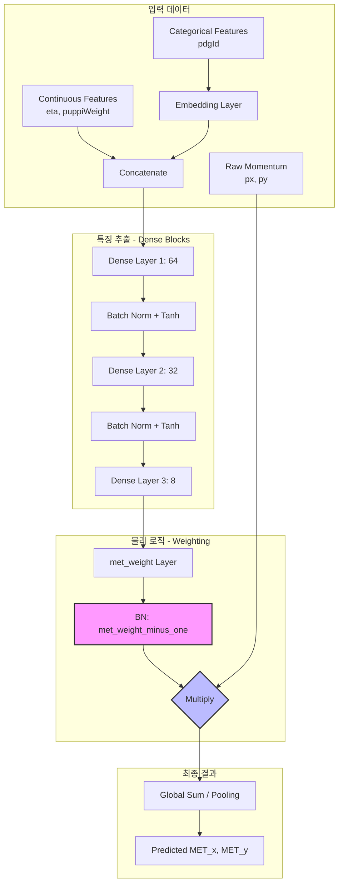

# 🚀 L1METML Project Deep Dive

이 프로젝트는 CMS 실험의 **L1 트리거(Level-1 Trigger)** 환경에서 머신러닝을 활용해 **결손 가로 에너지(MET)**를 초고속·고정밀로 재구성하는 시스템입니다.

---

## 🏗️ 1. 시스템 아키텍처 (System Architecture)

모델의 내부 구조와 데이터 흐름을 시각화한 모식도입니다.



---

## 📊 2. 데이터 구조 상세 (Data Specification)

모델이 입자를 인식하는 방식은 크게 두 가지로 나뉩니다.

| 분류 | 특징 (Features) | 처리 방식 | 역할 |
| :--- | :--- | :--- | :--- |
| **연속형 (Cont.)** | $\eta$, PuppiWeight | Scaling & Concatenation | 입자의 기하학적 위치와 신뢰도 제공 |
| **범주형 (Cat.)** | PDG ID (입자 종류) | **Embedding (8-dim)** | 입자의 고유 특성(질량, 전하 등) 추상화 |
| **원시 물리량** | $p_x, p_y$ | **Direct Pass-through** | 최종 에너지 합산의 베이스라인 |

---

## ⚙️ 3. 핵심 알고리즘 설명

### ① DeepMET 방식의 가중치 학습
이 모델은 MET 값을 직접 예측하지 않습니다. 대신 **"각 입자의 운동량을 얼마나 믿을 것인가($w$)"**를 학습합니다.
*   **수식**: $\vec{MET}_{pred} = \sum_{i=1}^{N} w_i \cdot \vec{p}_{i, raw}$
*   **이점**: $w=1$이면 기존의 물리적 합산과 동일해집니다. 모델은 여기서부터 미세한 보정값만 찾으면 되므로 학습이 매우 빠르고 물리적으로 안정적입니다.

### ② 하드웨어 지향 설계 (FPGA/L1 Trigger)
*   **Low Latency**: 복잡한 RNN이나 Transformer 대신 가벼운 Dense 레이어를 사용하여 수십 나노초 내에 연산이 가능하도록 설계되었습니다.
*   **Quantization (Qkeras)**: 향후 `qkeras`를 통해 비트 수를 줄여(예: 8-bit) 하드웨어 자원 소모를 최소화할 수 있는 구조를 갖추고 있습니다.

---

## 🔄 4. 전체 워크플로우 (End-to-End Workflow)

1.  **Data Prep**: `convertNanoToHDF5.py`를 통해 ROOT 파일을 H5 포맷으로 변환.
2.  **Config**: `configs/eta_puppi_pdgid.yaml`에서 실험 파라미터 설정.
3.  **Generator**: `DataGenerator.py`가 데이터를 CPU에서 읽고 전처리(`preProcessing`).
4.  **Acceleration**: `train.py`에서 `.cache()`를 이용해 전처리된 데이터를 RAM에 상주시켜 IO 병목 제거.
5.  **Training**: `custom_loss.py`의 물리적 손실 함수를 기반으로 가중치 최적화.
6.  **Evaluation**: `utils.py`의 `MakePlots`를 호출하여 해상도(Resolution) 및 반응성(Response) 그래프 생성.

---

## 📉 5. 손실 함수 (Loss Function)의 물리적 의미

단순한 MSE(Mean Squared Error) 외에 물리적 특성을 고려한 **Custom Loss**를 사용합니다.
*   **MSE/MAE Weight**: 예측값과 실제값 사이의 거리 최소화.
*   **Symmetry Penalty**: $MET_x$와 $MET_y$의 예측 편향이 생기지 않도록 대칭성 유지.
*   **Response Correction**: 에너지 측정값이 한쪽으로 치우치지 않도록 보정 유도.

---

## 🚀 6. 프로젝트 실행 가이드

```bash
# 1. 환경 설정 (Conda/L1METML 환경)
./conda_setup.sh

# 2. 학습 실행 (메모리 캐싱 적용 버전)
python train.py --config configs/eta_puppi_pdgid.yaml

# 3. 결과 확인
# results/eta_puppi_pdgid/ 폴더 내 png 파일들 확인
```
